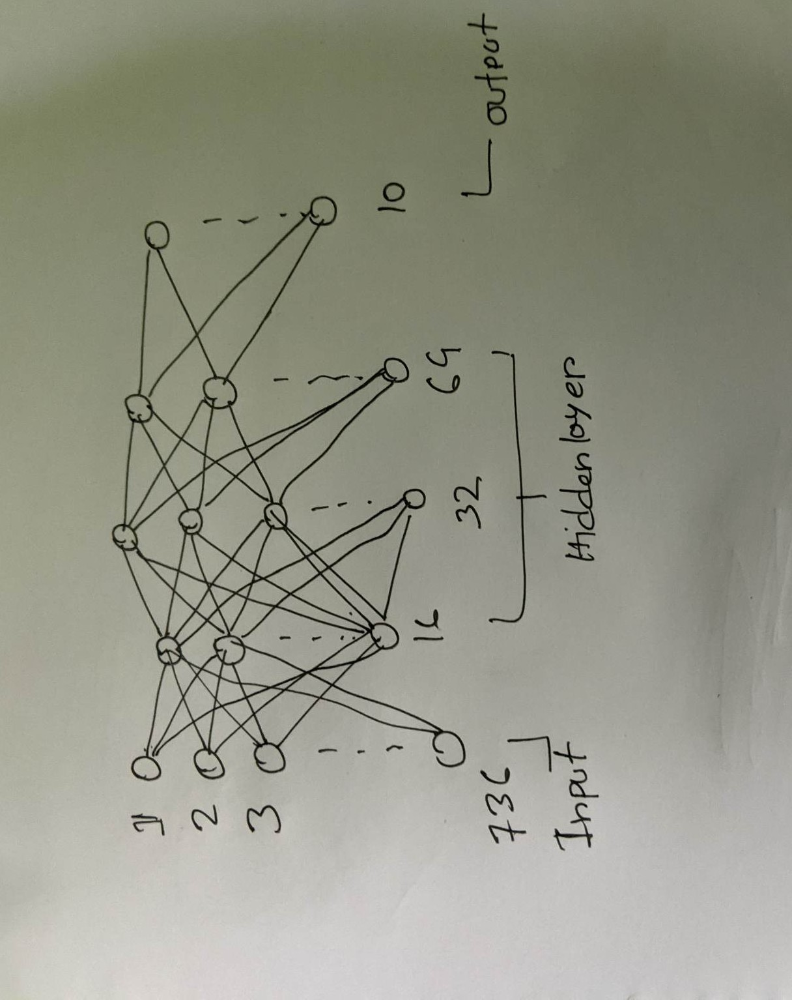

# Build a neural network using Tensorflow - Keras


## Create Model

```py
from tensorflow.keras import models, layers

model = models.Sequential([
        layers.Flatten(input_shape=(756,), name="input_layer"),
        layers.Dense(16, activation='sigmoid', name = "hidden_layer_1"),
        layers.Dense(32, activation='tanh', name = "hidden_layer_2"),
        layers.Dense(64, activation='relu', name = "hidden_layer_3"),
        layers.Dense(10, activation='softmax', name = "output_layer")    
    ])

model.summary()
```

**Model Summary**:

```text
Model: "sequential_4"
_________________________________________________________________
 Layer (type)                Output Shape              Param #   
=================================================================
 input_layer (Flatten)       (None, 756)               0         
                                                                 
 hidden_layer_1 (Dense)      (None, 16)                12112     
                                                                 
 hidden_layer_2 (Dense)     (None, 32)                544       
                                                                 
 hidden_layer_3 (Dense)    (None, 64)                2112      
                                                                 
 output_layer (Dense)        (None, 10)                650       
                                                                 
=================================================================
Total params: 15,418
Trainable params: 15,418
Non-trainable params: 0
```

### Neural Network Drawing



