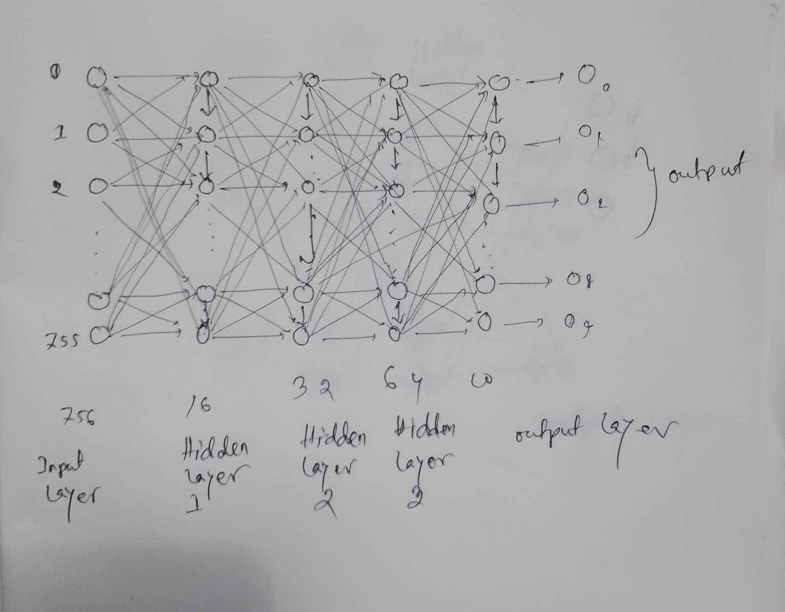

# Build a neural network using Tensorflow - Keras

- [Build a neural network using Tensorflow - Keras](#build-a-neural-network-using-tensorflow---keras)
    - [Tasks](#tasks)
    - [Create Model](#create-model)
    - [Network](#network)


### Tasks

1. Size of inputs vectors :756
2. Size of output vectors: 10
3. 3 fully connected hidden layers: 1st hidden layer with 16 neurons, 2nd hidden layer with 32 neurons, 3rd hidden layer with 64 neurons
4. Activation functions of the neurons of the output layer: softmax
5. Activation functions of the neurons of three hidden layers: three different kinds of non-linear functions 


### Create Model

```py
from tensorflow.keras import models
from tensorflow.keras import layers

nn_model = models.Sequential([
        layers.Flatten(input_shape=(756,), name="input_layer"),
        layers.Dense(16, activation='tanh', name = "hidden_layer_i"),
        layers.Dense(32, activation='sigmoid', name = "hidden_layer_ii"),
        layers.Dense(64, activation='relu', name = "hidden_layer_iii"),
        layers.Dense(10, activation='softmax', name = "output_layer")    
    ])

nn_model.summary()
```

**Model Summary**:

```text
Model: "sequential_4"
_________________________________________________________________
 Layer (type)                Output Shape              Param #   
=================================================================
 input_layer (Flatten)       (None, 756)               0         
                                                                 
 hidden_layer_i (Dense)      (None, 16)                12112     
                                                                 
 hidden_layer_ii (Dense)     (None, 32)                544       
                                                                 
 hidden_layer_iii (Dense)    (None, 64)                2112      
                                                                 
 output_layer (Dense)        (None, 10)                650       
                                                                 
=================================================================
Total params: 15,418
Trainable params: 15,418
Non-trainable params: 0
```

### Network



