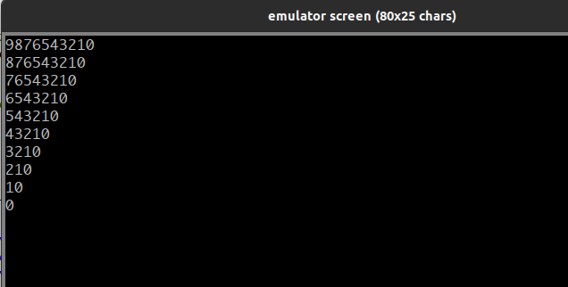
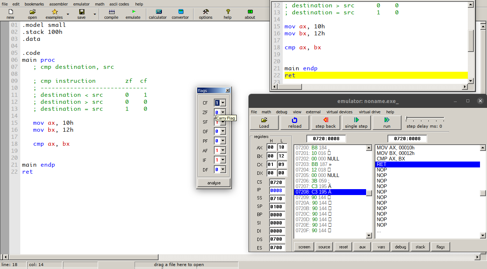

# Intel Microprocessor and Assembly Language 8086

- [Intel Microprocessor and Assembly Language 8086](#intel-microprocessor-and-assembly-language-8086)
  - [Introduction to Assembly Language](#introduction-to-assembly-language)
  - [Basic Code Structure in Assembly (C Like)](#basic-code-structure-in-assembly-c-like)
  - [Addressing Mode in Assembly Language](#addressing-mode-in-assembly-language)
  - [General Rules in Assembly Language](#general-rules-in-assembly-language)
  - [Service Routines ,Interrupt in Assembly language](#service-routines-interrupt-in-assembly-language)
  - [Variables in Assembly Language](#variables-in-assembly-language)
  - [Hello World in Assembly Language](#hello-world-in-assembly-language)
  - [JMP(Unconditional Jump) Instruction in Assembly Language](#jmpunconditional-jump-instruction-in-assembly-language)
  - [Loop Instruction in Assembly Language](#loop-instruction-in-assembly-language)
  - [Simple 2-D Nested Loop in Assembly Language](#simple-2-d-nested-loop-in-assembly-language)
  - [INC and DEC in Assembly Language](#inc-and-dec-in-assembly-language)
  - [CMP in Assembly Language](#cmp-in-assembly-language)
  - [Conditional Jump in `JC`, `JNC`, `ZC` And `ZNC` in Assembly Language](#conditional-jump-in-jc-jnc-zc-and-znc-in-assembly-language)
  - [Conditional Jump `JE` and `JNE` in Assembly Language](#conditional-jump-je-and-jne-in-assembly-language)
  - [Count Number Of Characters You Take As Input In Assembly Language](#count-number-of-characters-you-take-as-input-in-assembly-language)
  - [Convert Lowercase to Uppercase Letter in Assembly Language](#convert-lowercase-to-uppercase-letter-in-assembly-language)
  - [Conditional Jump `JA`,`JNA`,`JB`,`JNB`,`JAE`,`JBE` in Assembly Language](#conditional-jump-jajnajbjnbjaejbe-in-assembly-language)
  - [Ascii Table in Assembly Language](#ascii-table-in-assembly-language)
  - [Procedure in Assembly Language](#procedure-in-assembly-language)
  - [Nested Procedure in Assembly Language](#nested-procedure-in-assembly-language)

## Introduction to Assembly Language

**General Purpose Registers**:

- `AX`: Basic arithmetic operation.
- `BX`: Contain program base address.
- `CX`: Loop Control
- `DX`: Store data and transfer this data in I/0 devices.

Comment in assembly language:

```assembly
; this is a comment
; this is another comment
```

## Basic Code Structure in Assembly (C Like)

```assembly
; Basic Structure of Assembly Language
.model small
.stack 100h

.data
    ; define your variable here

.code
main proc
    ; initialize data segment
    mov ax, @data
    mov ds, ax

    ; write you instruction here


    EXIT:
        mov ah, 4ch
        int 21h
main endp
ret
```


**MOV instruction**:

Signature:

```text
MOV destination, source
```

**Note**:

- Both destination and source can be registers but not memory address.
- Value cannot be destination.

**Pass Value To Ax & Al Register And Investigate**:

`./ak-01-pass_value_to_accumulator_register_and_investigate.asm`

```assembly
; here .model .data .code .stack is called directives

.model small
.data
.stack 100h
   
.code      

main PROC
 
    mov al,78 ; pass al (lower half of ax) register to decimal 78 
                ; but by default it pass as hex-decimal  78 -> 4E
                ; if you want to pass 78 hex then you need to pass 78h or 78H
    
    mov ax, 782h ; store data on 16-bit ax register
    mov al, 83h 
    
main endp   
ret
```

| Instruction    | Action                    |
| -------------- | ------------------------- |
| `mov al, 78`   | **ah**: `00`, **al**:`4e` |
| `mov ax, 782h` | **ah**: `07`, **al**:`82` |
| `mov al, 83h`  | **ah**: `07`, **al**:`83` |

- In `mov al, 78`    - store to `al` 4e, because store data as hex but we pass decimal.
- In `mov ax, 782h`  - store both `ah` and `al` register.
- In `mov al, 83h`   - modify `al` part but `ah` part contains its previous value.

## Addressing Mode in Assembly Language

```text
7 + 8 

Suppose we assume 7 store in al register and 8 store in bl register. Now for this operation the assembly code is,

ADD al, bl        ; and final data store in al register
```

- **Register Addressing**: `MOV ax, bx ; register to register` 
- **Immediate Addressing**: `MOV ax, 45 ; value/constant to register`
- **Memory Addressing**: `MOV AX, num ; memory address to register`

## General Rules in Assembly Language

```text

** Both operands have to be of the same size

- MOV AX, BL              ; ILLEGAL   16 bits != 8 bits
- MOV AL, BL              ; LEGAL      8 bits == 8 bits
- MOV AH, BL              ; LEGAL      8 bits == 8 bits

** Both operands cannot be memory operands simultaneously

- MOV i, j                ; ILLEGAL 
- MOV AL, i               ; LEGAL

** First operand cannot be an immediate value

- MOV 73, AX              ; ILLEGAL
- MOV AX, 2               ; LEGAL

```

`./ak-02-general-rules-of-mov.asm`

```assembly
; here .model .data .code .stack is called directives

.model small
.data
.stack 100h
   
.code      

main PROC

    mov al, 2h
    mov bl, 3h
    
    mov al, bl ; legal
    
    mov ax, 4h 
    ; mov bl, ax ; illegal
    
    mov 5h, al  ; Not - illegal
    mov al, 6h  ; legal
    
    ; add 5, al  ; illegal
    
main endp   
ret                        
```

## Service Routines ,Interrupt in Assembly language 

Stands for "Interrupt Service Routine." An ISR (also called an interrupt handler) is a software process invoked by an interrupt request from a hardware device. It handles the request and sends it to the CPU, interrupting the active process. When the ISR is complete, the process is resumed.

A basic example of an ISR is a routine that handles keyboard events, such as pressing or releasing a key. Each time a key is pressed, the the ISR processes the input. For example, if you press and hold the right arrow key in a text file, the ISR will signal to the CPU that the right arrow key is depressed. The CPU sends this information to the active word processor or text editing program, which will move the cursor to the right. When you let go of the key, the ISR handles the "key up" event. This interrupts the previous "key down" state, which signals to the program to stop moving the cursor.


Many types of hardware devices, including internal components and external peripherals can sent interrupts to the CPU. Examples include keyboards, mice, sound cards, and hard drives. A device driver enables communication between each of these devices and the CPU. ISRs prioritize interrupt requests based on the IRQ setting of the device (or port). Typically the keyboard is at the top of the IRQ list, while devices like hard drives are further down.

**Service Routines or Functions**

```assembly

mov dl, 23h

mov ah, 02
int 21h
```

Here in `mov ah, 02` instruction `02` is a function or service routine that is used to display single character on the monitor. After pass `02` on `ah` register we need to `int 21h` interrupt `21h`. This two line of instructions, print single character from `data register` to monitor. 

**Other Service Routines**:

- `1`: Input single character (show on the monitor when read).
- `2`: Show single character on the monitor.
- `8`: Input single character (don't show character)
- `9`: Print collection of characters
- `4ch`: Exit

**Interrupts**:

Two kinds of interrupts:

    - Hardware Interrupts
    - Software Interrupts [int]

```  
0 to 255 interrupts, 27 reserved for system. 224 we can use.
```

- **int 21h**: for text handling.
- **int 20h**: for video handling.

```assembly
; here .model .data .code .stack is called directives

.model small
.data
.stack 100h
   
.code      

main PROC                                             
                 
    ; input a character from keyboard and store it in al register
    mov ah, 01
    int 21h
                                                                 
    ; print that we take as input
    ; 1. first we need to pass value/character al to dl cause 02 service routine
    ; show the monitor what inside the dl register
    
    mov dl, al; mov al register data to dl register
    
    mov ah, 02 ; service routine 2 pass in ah register
    int 21h 
                                         
    ; we also can directly pass character to dl register
    mov dl, 'N'
    
    mov ah, 02     ; display N on the monitor
    int 21h                                      
                                         
main endp   
ret                        
```

## Variables in Assembly Language

- `db`: Define Byte (8-bits)
- `dw`: Define Word (16-bits)
- `dd`: Define Double (32-bits)
- `dq`: Define Quote (64-bits)
- `dt`: Define Ten (80-bits)


```assembly
.data 
    ; The ‘$’ marks the end of the string and is not displayed. 
    ; If the string contains the ASCII code of a control character, the control function is performed.
    msg db "Hello!$" ;
    var db 35h
    newline db ? 
```

- **Way to data segment get initialized.**

```assembly
.code

main proc
    ; Mov ax,@data is way of loading starting address of data segment in ax. 
    ; then by using mov ds,ax data segment gets initialized. 
    
    mov ax,@data
    mov ds,ax
```

```assembly
.model small
.stack 100h
.data 
    ; The ‘$’ marks the end of the string and is not displayed. 
    ; If the string contains the ASCII code of a control character, the control function is performed.
    msg db "Hello!$" ;
    var db 35h
    
    ; use 10 then 13 make newline
    linefeed db 10
    carriage_return db 13 

.code

main proc
    ; Mov ax,@data is way of loading starting address of data segment in ax. 
    ; then by using mov ds,ax data segment gets initialized.
    
    ; for works with data segment variables in the top you need to place those two lines of command
    mov ax,@data               ; load starting address of data segment
    mov ds,ax                  ; initialize data segment


    mov dl, var                ; decimal 5 
    mov ah,2
    int 21h 
         
         
    mov dl, linefeed           ; move cursor to the next line
    mov ah,2
    int 21h 
    
    mov dl, carriage_return    ; move cursor beginning of the lin
    mov ah,2
    int 21h 
    
         
    mov dl, msg                ; H
    mov ah,2
    int 21h 
    
    mov dl, msg + 1            ; e
    mov ah,2
    int 21h 
    
    mov dl, msg + 2            ; l
    mov ah,2
    int 21h 
    
    mov dl, msg + 3            ; l
    mov ah,2
    int 21h 
    
    mov dl, msg + 4            ; o
    mov ah,2
    int 21h 
                   
    mov dl, msg + 5            ; !
    mov ah,2
    int 21h 
    
main endp  
ret
```

## Hello World in Assembly Language

```assembly
.model small
.stack 100h
.data 
    msg db "Hello", "!", 10,13,"$" 
    msg1 db "Assembly", 63 , "$"  

.code

main proc
    ; initialize data segment
    mov ax,@data
    mov ds,ax

    ; puts the offset address of the variable MSG into DX.
    lea dx, msg ; lea -> load effective address.

    ; prints character one by one
    mov ah, 9; function 9 / service routine is for printing string of characters.
    int 21h
    
    lea dx, msg1
    
    mov ah, 9
    int 21h 
   
main endp  
ret    
```

## JMP(Unconditional Jump) Instruction in Assembly Language

```assembly
.model small
.stack 100h
.data 
    msg db "Hello", "!", 10,13,"$" 
    msg1 db "Assembly", 63 , "$"  

.code

main proc
    ; initialize data segment
    mov ax,@data
    mov ds,ax
    
    ; In the x86 assembly language, the JMP instruction performs an unconditional jump. 
    ; Such an instruction transfers the flow of execution by changing the instruction pointer register.
    jmp message_1        ; jmp label -> change the flow of execution to message_1: 
                                                                                  
    ; ----------------------------------------------------------------------------
    ;                      This part is ignored                                                                 
    ; ----------------------------------------------------------------------------                       
    ; puts the offset address of the variable MSG into DX.
    lea dx, msg ; lea -> load effective address.

    ; prints character one by one
    mov ah, 9; function 9 / service routine is for printing string of characters.
    int 21h
    ; ----------------------------------------------------------------------------             
    message_1: 
        lea dx, msg1     ; 
    
        mov ah, 9
        int 21h 
   
main endp  
ret    
```

## Loop Instruction in Assembly Language

- **Infinite Loop**:

```assembly
.model small
.stack 100h
.data
    prompt      db "Enter any character: $" 
    newline     db 10, 13, "$" 
.code

main proc
    ; initialize data segment
    mov ax, @data
    mov ds, ax        
    
    loop_control:
        ; Enter any character: 
        lea dx, prompt
        mov ah, 09
        int 21h
        
        ; take input
        mov ah, 01
        int 21h
        
        ; mov al to dl and print
        mov dl, al
        mov ah, 02
        int 21h
        
        ; new line
        lea dx, newline
        mov ah, 09
        int 21h                
                  
        
    loop loop_control
    
main endp  
ret    
```

- **Finite Loop**:

Just initialize **CX** register.

```assembly
.model small
.stack 100h
.data
    prompt      db "Enter any character: $" 
    newline     db 10, 13, "$" 
.code

main proc
    ; initialize data segment
    mov ax, @data
    mov ds, ax
    
    ; initialize CX register
    mov cx, 05d ; automatically cx register is decreased
                ; if value of cx is zero than loop closed       
    
    loop_control:      
    
        ; Enter any character: 
        lea dx, prompt
        mov ah, 09
        int 21h
        
        ; take input
        mov ah, 01
        int 21h
        
        ; mov al to dl and print
        mov dl, al
        mov ah, 02
        int 21h
        
        ; new line
        lea dx, newline
        mov ah, 09
        int 21h                
        
    loop loop_control
    
    ; exit program
    mov ah, 4ch
    int 21h
    
main endp  
ret    
```

## Simple 2-D Nested Loop in Assembly Language

```assembly
.model small
.stack 100h
.data
    newline db 10, 13, "$"
.code

main proc
    ; initialize data segment
    mov ax, @data
    mov ds, ax 

    ; nested loop example
    mov cx, 10 ; initialize cx register for outer loop
    outer_loop:
        mov bx, cx ; store outer_loop cx register value
 
        mov cx, bx ; initialize cx register for inner_loop           
        inner_loop:
        
            mov dx, cx ; mov the value of cx register to dx register
            add dx, 47 ; add 47 for assembly lang works with ascii value
            mov ah, 02 ; 02 function is for print single character
            int 21h    ; interrupt 
            
            
        loop inner_loop
        mov cx, bx ; back to the outer_loop cx register value 
        
        lea dx, newline
        mov ah, 09
        int 21h
            
    loop outer_loop
    ; exit program
    mov ah, 4ch
    int 21h
    
main endp  
ret    
```



## INC and DEC in Assembly Language

```assembly
.model small
.stack 100h
.data         

.code 
main proc 
    ; investigate value on emulator register
     
    mov ax, 25h ; 37
    inc ax      ; 38
    dec ax      ; 37
    
    mov ah, 4ch
    int 21h    
    
main endp
ret
```

## CMP in Assembly Language

```assembly 
.model small
.stack 100h
.data         

.code 
main proc 
   ; cmp destination, src
    
   ; cmp instruction        zf  cf 
   ; -----------------------------
   ; destination < src      0    1
   ; destination > src      0    0
   ; destination = src      1    0
                                  
   mov ax, 10h
   mov bx, 12h
   
   cmp ax, bx                               
                                  
main endp
ret
```



## Conditional Jump in `JC`, `JNC`, `ZC` And `ZNC` in Assembly Language

```text
   cmp instruction        zf  cf 
   -----------------------------
   destination < src      0    1      jc active 
   destination > src      0    0    
   destination = src      1    0      jz active
```

```assembly
.model small
.stack 100h
.data
    first_num_msg db 10, 13, "Enter first number: $"
    second_num_msg db 10, 13, "Enter second number: $"
    
    msg1 db 10, 13, 'First number is greater than Second number!$'
    msg2 db 10, 13, 'First number is less than Second number!$'
    msg3 db 10, 13, 'Both number is equal!$'

    src db ?             ; read and store first number

.code

main proc
    
    mov ax, @data
    mov ds, ax

    lea dx, first_num_msg
    mov ah, 09
    int 21h

    mov ah, 01
    int 21h
    
    mov src, al
    
    lea dx, second_num_msg
    mov ah, 09
    int 21h
    
    mov ah, 01
    int 21h
    
    cmp al, src
    
    jz zero_1
    jc carry_1
    jnc carry_0
    
    carry_1:
        lea dx, msg1
        mov ah, 09
        int 21h
        jmp exit    
        
    carry_0:
        lea dx, msg2
        mov ah, 09
        int 21h
        jmp exit
    
    zero_1:
        lea dx, msg3
        mov ah, 09
        int 21h
        jmp exit
    
    
    exit:
        mov ah, 4ch
        int 21h
    
main endp
ret
```

## Conditional Jump `JE` and `JNE` in Assembly Language

```assembly
.model small
.stack 100h
.data
    newline db 10,13,"$"
    
    msg1 db 'Both are equal$'
    msg2 db 'Both are not equal$'
    
.code

main proc
    
    mov ax, @data
    mov ds, ax
    
    mov ax, 10h
    mov bx, 11h
    
    
    je equal
    ; jne label is just opposite of the 
    
        lea dx, msg2
        mov ah, 09
        int 21h
        jmp exit
    
    equal:
        lea dx, msg1
        mov ah, 09
        int 21h
        jmp exit    
    
    exit:
        mov ah, 4ch
        int 21h
    
main endp
ret
```

## Count Number Of Characters You Take As Input In Assembly Language

```
.model small
.stack 100h
.data
    newline db 10,13,"$"
    
.code

main proc
    mov ax, @data
    mov ds, ax
    
    ; first mov 0 on dl register
    mov bl, 0
    
    ; read characters
    ; if press q program loop is exit and show the 
    ; number of character you take as input
    
    loop_control:
        mov ah, 01
        int 21h
        
        inc bl
        
        cmp al, 'q'
        ; jz display_msg 
        je display_msg
        
    loop loop_control
    
    display_msg:
        lea dx, newline
        mov ah, 09
        int 21h
         
        mov dl, bl 
        add dl, 48
        mov ah, 02
        int 21h
        jmp exit
    
    exit:
        mov ah, 4ch
        int 21h
    
main endp
ret
```

## Convert Lowercase to Uppercase Letter in Assembly Language

```assembly
; convert small letter to capital letter
.model small
.stack 100h
.data
    newline db 10, 13, "$"
    
.code

main proc
    ; initialize data segment
    mov ax, @data ; send first offset address
    mov ds, ax    ; initialize data segment
   
    ; make loop that run 5 times
    mov cx, 5
    
    loop_control:
        mov ah, 01 ; take input and store in al register
        int 21h
        
        ; mov al register to dl register for display using 02 service routine/function
        mov dl, al
        ; subtract 32, to make character capital 
        ; hence we already know difference absolute between lowercase
        ; letter to uppercase letter is 32.
        ; so for upper to lower add 32 
        ; and lower to upper sub 32
        
        sub dl, 32  
        
        ; print it
        mov ah, 02
        int 21h
    
    loop loop_control
   
    exit:
        mov ah, 4ch
        int 21h
main endp
ret
```

## Conditional Jump `JA`,`JNA`,`JB`,`JNB`,`JAE`,`JBE` in Assembly Language 

```assembly
; convert small letter to capital letter
.model small
.stack 100h
.data
    newline db 10, 13, "$"
    msg1 db 'dest$'
    msg2 db 'src$'
    
.code

main proc
    ; initialize data segment
    mov ax, @data ; send first offset address
    mov ds, ax    ; initialize data segment
   
    mov ax, 10h
    mov bx, 20h
    
    ; ja dest > src
    ; jae dest >= src
    ; jna dest < src
    
    ; jb dest < src
    ; jbe dest <= src
    ; jnb dest > src
    
    ; cmd dest, src
    cmp ax, bx                ; 10 < 20
    jna src                   ; ja/jae src   -> dest
                              ; jna src      -> src
    dest:                     ; opposite for jb, jbe, and jnb
        lea dx, msg1
        mov ah, 09
        int 21h        
        jmp exit
    
    src:
        lea dx, msg2
        mov ah, 09
        int 21h        
        jmp exit
    
    exit:
        mov ah, 4ch
        int 21h
main endp
ret
```

## Ascii Table in Assembly Language

```assembly
; print ascii table
.model small
.stack 100h
.data
    
.code

main proc
    mov dl, 0
    
    mov cx, 255
    
    loop_control:
        mov ah, 02
        int 21h       
        inc dl
    loop loop_control

    exit:
        mov ah, 4ch
        int 21h
main endp
ret
```

## Procedure in Assembly Language

```text
; To create a procedure
;
; label proc
;     instruction...1
;     instruction...2
;     instruction...3
;           :
;           :
;           :
;     instruction...n
;     ret
;
; label endp
```

```Assembly
; multiple procedure (like function) in assembly language
.model small
.stack 100h
.data 
    nl db 10,13,'$' 
    
    msg db 'Hello world_$'
    
.code

main proc
    mov ax, @data
    mov ds, ax
           
    mov bl, 49       
           
    call hello
    call newline
    call hello
    call newline
    call hello
    call newline
    
    call exit
    
ret
main endp   

; To create a procedure
;
; label proc
;     instruction...1
;     instruction...2
;     instruction...3
;           :
;           :
;           :
;     instruction...n
;     ret
;
; label endp

hello proc
    lea dx, msg
    mov ah, 09
    int 21h
    
    mov dl, bl
    mov ah, 02
    int 21h
    inc bl
   
    ret
hello endp

exit proc
    mov ah, 4ch
    int 21h
    
    ret
exit endp

newline proc
    lea dx, nl
    mov ah, 09
    int 21h
ret
newline endp
```

## Nested Procedure in Assembly Language

**Nested procedure**: Simply you can call one procedure from another procedure. Like any procedure we call in previous example is from another procedure. 

