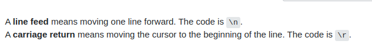
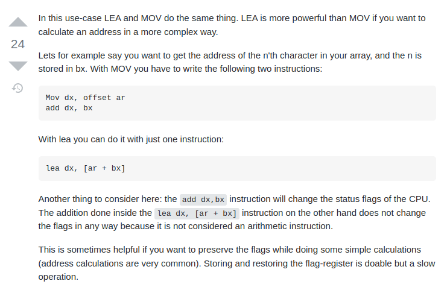

# CSE-3232 (Microprocessor and Assembly Language Lab)

**Table of Contents**:

- [CSE-3232 (Microprocessor and Assembly Language Lab)](#cse-3232-microprocessor-and-assembly-language-lab)
  - [Some Basic Terminology for String Operation in Assembly Language](#some-basic-terminology-for-string-operation-in-assembly-language)
    - [Take String Input and Display Output](#take-string-input-and-display-output)
    - ["Line Feed" Vs "Carriage Return"](#line-feed-vs-carriage-return)
    - [`lea` and `offset`](#lea-and-offset)
  - [Experiment-1 (String Reverse)](#experiment-1-string-reverse)
  - [Experiment - 2 (CaSE ConvERsion)](#experiment---2-case-conversion)
  - [Experiment -  4(Max and Min char in String)](#experiment----4max-and-min-char-in-string)

## Some Basic Terminology for String Operation in Assembly Language

**Note**: File `./Basics.pdf` contains some basic information with proper examples. 

- Hello world
- Service Routine
- Input and Output
- Loop (Simple and Nested)
- Jump (Both Conditional and Unconditional)

### Take String Input and Display Output

```assembly
; read string 
.model small
.stack 100h

.data                        
; msg is a array variable with length 50, we places '$' in dup() because in assembly
; string ends with character '$'

msg db 50 dup('$')            
newline db 10, 13, '$'   ; 10 -> line feed and 13 carriage return

.code 
main proc
    ; initialize data segment
    mov ax, @data
    mov ds, ax
        
    ; below both statement are same
    ;mov si, offset msg
    ; To access array we need to define the si register with start offset address of the variable   
    lea si, msg                  ; mov starting offset address into the si register
    
    
    ; read string and store into the variable msg
    loop_1:
        mov ah, 01                ; read single character and by default it store on the al register
        int 21h
        
        ; if user press enter key the program jumpped into the display_and_exit where we display 
        ; what we store on the msg variable
        cmp al, 13 ; 13 enter key  
        je display_and_exit   
        
        
        mov [si], al
        ; increment offset
        inc si
    loop loop_1
        
    
    display_and_exit:
        ; we need to print newline because if we don't print newline
        ; the result is shown above the input ... you getting confused.
        mov dx, offset newline
        ; lea dx, newline 
        mov ah, 09         ; print string until find '$' sign
        int 21h                                                  
        
        ; lea dx,  msg
        mov dx, offset msg
        mov ah, 09
        int 21h
        
        mov ah, 4ch
        int 21h
        
main endp
end main
```

### "Line Feed" Vs "Carriage Return"



### `lea` and `offset` 



> If you are already familiar with take string input and display it on the monitor then you are ready for perform various string operation.

## Experiment-1 (String Reverse)

> Simple enough: VISUALIZATION

1. Input Prompt. 
2. Read string until user press enter key.
3. Print newline and output prompt.
4. Display result in reverse order.

```
READ abcdef

si[0]   si[1]   si[2]   si[3]   si[4]   si[5]   si[6]
   a       b       c       d       e       f     final si offset value
```

1. So first we need to decrease `si` by `1`
2. Then `mov` one by one value into the `dl` register and decrease the `si` register.
3. Using function `02` print the character from dl register.
3. If `si` is `zero` then `exit` the program.

```assembly
.model small
.stack 100h

.data
    msg db 100 dup('$')                      ; to store string 
    newline db 10,13,'$'                     ; for newline
    input_prompt db 'Enter the string: $'    ; PROMPT for take input
    output_prompt db 'After modifying: $'    ; PROMPT for display result

.code

MAIN proc
    ; initialize data segment
    mov ax, @data
    mov ds, ax
    
    ; initialize the input_array
    mov si, offset msg
    ;lea si, msg
    
    
    ; INPUT PROMPT
    lea dx, input_prompt
    mov ah, 09
    int 21h
        
    READ_STRING:   
        ; read characters one by one
        mov ah, 01
        int 21h
        
        ; if user press enter key -> stop reading and jump equal in REVERSE_STRING label
        cmp al, 13              ; 13 is the ascii value for enter key
        je REVERSE_STRING
        
        mov [si], al                     ; same as msg[si], al
        inc si    
    loop READ_STRING
    
    REVERSE_STRING:
        ; newline
        lea dx, newline
        mov ah, 09
        int 21h
        ;OUTPUT PROMPT
        lea dx, output_prompt
        mov ah, 09
        int 21h
        
        ; display string in reverse order
        dec si ; decrease the si register
        LOOP_REVERSE:
            mov dl, [si]  ; read the value of msg[si]   

            mov ah, 02
            int 21h
            
            cmp si, 0     ; compare with 0, if si == 0 then it is now in starting address and exit
            je EXIT
        
            dec si
        loop LOOP_REVERSE
     
    EXIT:
        mov ah, 4ch
        int 21h
            
MAIN endp ; end procedure main
end main
```

## Experiment - 2 (CaSE ConvERsion)

```assembly
.model small
.stack 100h

.data
    msg db 100 dup('$')                      ; to store string 
    newline db 10,13,'$'                     ; for newline
    input_prompt db 'Enter the string: $'    ; PROMPT for take input
    output_prompt db 'After modifying: $'    ; PROMPT for display result

.code

MAIN proc
    ; initialize data segment
    mov ax, @data
    mov ds, ax
    
    ; initialize the input_array
    mov si, offset msg
    ;lea si, msg
    
    
    ; INPUT PROMPT
    lea dx, input_prompt
    mov ah, 09
    int 21h
        
    READ_STRING:   
        ; read characters one by one
        mov ah, 01
        int 21h
        
        ; if user press enter key -> stop reading and jump equal in REVERSE_STRING label
        cmp al, 13              ; 13 is the ascii value for enter key
        je DISPLAY_STRING
        
        ; -----------------------------------------------
        ; before store change the lowercase to uppercase 
        ; IF NOT alphabet no need to change
        ;------------------------------------------------
        cmp al, 'z'
        jg NOCHANGE       ; if char greater than 'z' NOCHANGE
        cmp al, 'A'
        jl NOCHANGE       ; if char less than 'A' NOCHANGE
        cmp al, 'Z'
        jg TOP            ; if char greater than 'Z' MOVE to TOP label
        
        jmp CC            ; cc -> CaSE ConvERsion
        TOP:
            cmp al, 'a'
            jl NOCHANGE   ; Now if char less than 'a' NOCHANGE
        CC: 
            ; xor with 32 convert lower to upper and upper to lower
            xor al, 32    ; Everything else change the char 
        
        NOCHANGE:
            mov [si], al                     ; same as msg[si], al
            inc si    
    loop READ_STRING
    
    DISPLAY_STRING:
        ; newline
        lea dx, newline
        mov ah, 09
        int 21h
        ;OUTPUT PROMPT
        lea dx, output_prompt
        mov ah, 09
        int 21h
        
        lea dx, msg
        mov ah, 09
        int 21h
        
    EXIT:
        mov ah, 4ch
        int 21h
            
MAIN endp ; end procedure main
end main
```

## Experiment -  4(Max and Min char in String)

```assembly
.model small
.stack 100h

.data
    newline db 10,13,'$'                     ; for newline
    input_prompt db 'Enter the string: $'    ; PROMPT for take input
    MX db 'MAX: $'                           ; PROMPT for display result 
    MN db 'MIN: $'    
    
.code

MAIN proc
    ; initialize data segment
    mov ax, @data
    mov ds, ax
    
    ; INPUT PROMPT                                                       
    lea dx, input_prompt
    mov ah, 09
    int 21h
 
    mov bl, 'z'
    mov bh, '0'
        
    READ_STRING:   
        ; read characters one by one
        mov ah, 01
        int 21h
        
        ; if user press enter key -> stop reading and jump equal in REVERSE_STRING label
        cmp al, 13              ; 13 is the ascii value for enter key
        je DISPLAY_RESULT
        
        cmp al, bh        
        jg MAX
        
        cmp al, bl
        jl MIN
        
        MAX:
           mov bh, al
           jmp END
        MIN:
            mov bl, al
        
        END:
    loop READ_STRING
    
    DISPLAY_RESULT:
        ; newline
        lea dx, newline
        mov ah, 09
        int 21h
        
        ; prompt for max 
        lea dx, MX
        mov ah, 09
        int 21h
        
        mov dl, bh ; MAX
        mov ah, 02
        int 21h
        
        ; newline
        lea dx, newline
        mov ah, 09
        int 21h
        
        ; prompt for min
        lea dx, MN
        mov ah, 09
        int 21h
        
        mov dl, bl ; MIN
        mov ah, 02
        int 21h
    EXIT:
        mov ah, 4ch
        int 21h
            
MAIN endp ; end procedure main
end main
```