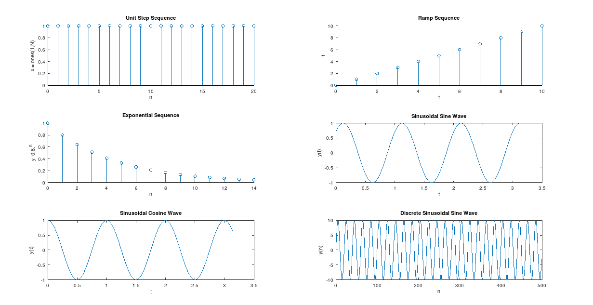
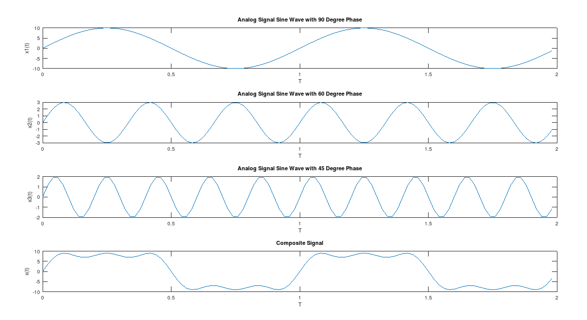

# DSP Lab Final

***WARNNING All code I written in octave. This code is same in Matlab but sometimes may cause error. Like "single qoutation" use in matlab but "both single and double qoutation used in octave" .... octave use "endfor" "endif" "endfunction" matlab just use "end"***

## List of Experiments

1. To develop programs for generating elementary signal functions like, 
    - Unit Step, Ramp, Exponential, Sine and Cosine sequences.
    - Demonstrate the effect of sampling, aliasing. <mark>Done</mark>
2. To develop the program for finding the convolution between two sequences. <mark>Done</mark>
3. To develop the program for finding the DFT.
4. To develop the program for finding the Autocorrelation of a sequence. <mark>Running</mark>
5. To develop the program for finding the magnitude and phase response of system described by system function H(s).
6. Mock Test. <mark>Done</mark>
7. Mock Test Advanced. 

## Table of Contents

- [DSP Lab Final](#dsp-lab-final)
  - [List of Experiments](#list-of-experiments)
  - [Table of Contents](#table-of-contents)
    - [Experiment - 1](#experiment---1)
    - [Experiment - 2](#experiment---2)
    - [Mock Test Solution - 1](#mock-test-solution---1)
    - [Mock Test Solution Advanced](#mock-test-solution-advanced)
    - [Experiment - 4 (Auto and Cross Correlation)](#experiment---4-auto-and-cross-correlation)
    - [Experiment - 3(DFT)](#experiment---3dft)
    - [Experiment - 5](#experiment---5)

### Experiment - 1

```matlab
% To develop programs for generating elementary signal functions like, 
% Unit Step, Ramp, Exponential, Sine and Cosine sequences.
% Demonstrate the effect of sampling, aliasing.

% 1) Unit Step Sequence

% N = input("Enter the number of data points for Unit Step Sequence: ");

N = 21; % number of data points
x = ones(1,N); 
n = 0:1:N-1;

subplot(3,2,1);
stem(n, x);
xlabel("n");
ylabel("x = ones(1,N)");
title("Unit Step Sequence");

% 2) Ramp Sequence

% N = input("Enter the length of Ramp Sequence: ");

N = 11;
t = 0:N-1;

subplot(3,2,2);
stem(t, t);
xlabel("t");
ylabel("t");
title("Ramp Sequence");

% 3) Exponential Sequence

% N = input("Enter the length of Exponential Sequence: ");

N = 15;
n = 0:N-1;
y = 0.8 .^ n;  % element wise power

subplot(3,2,3);
stem(n, y);
xlabel("n");
ylabel("y=0.8.^n");
title("Exponential Sequence");

% 4) Sinusoidal Sine Wave

t = 0:0.01:pi;
y = sin(2 * pi * t + pi/4); %  pi/4 = 45* is the phase of the wave
subplot(3,2,4);
plot(t, y);
xlabel("t");
ylabel("y(t)");
title("Sinusoidal Sine Wave");

% 5) Sinusoidal Cosine Wave

t = 0:0.01:pi;
y = cos(2 * pi * t);
subplot(3,2,5);
plot(t, y);
xlabel("t");
ylabel("y(t)");
title("Sinusoidal Cosine Wave");

% 6) Discrete Sinusoidal Signal
% x(n) = a * sin ( 2 * pi * (f / fs) * n + &)
% x(t) = 10 sin (2pi 500t)
% given,
a = 10;
f = 500;
fs = 20 * f;
N = 500; % 500 data points
n = 0:N-1;

y = a * sin(2 * pi * (f/fs) * n);

subplot(3,2,6);
plot(n, y);
xlabel("n");
ylabel("y(n)");
title("Discrete Sinusoidal Sine Wave");
```



**Part of Experiment - 1(Composite Harmonic Sinusoidal Signal)**:

```matlab
% _analog signal
% x(t) = 5 sin ( 2 * pi * 2 * t + phase)

clc;
clear all;
close all;

a = 10;
f = 1;
fs = 50 * f;
T = 2;
ph = 0; % 90 degree

t = 0:1/fs:T-(1/fs);

x1 = a * sin (2 * pi * f * t + ph);
a = 3; f = 3; ph=0;
x2 = a * sin (2 * pi * f * t + ph);
a = 2; f = 5; ph=0;
x3 = a * sin (2 * pi * f * t + ph);

x = x1 + x2 + x3;

hold on;
subplot(4,1,1);
plot(t, x1);
xlabel("T");
ylabel("x1(t)");
title("Analog Signal Sine Wave with 90 Degree Phase");

subplot(4,1,2);
plot(t, x2);
xlabel("T");
ylabel("x2(t)");
title("Analog Signal Sine Wave with 60 Degree Phase");


subplot(4,1,3);
plot(t, x3);
xlabel("T");
ylabel("x3(t)");
title("Analog Signal Sine Wave with 45 Degree Phase");


subplot(4,1,4);
plot(t, x);
xlabel("T");
ylabel("x(t)");
title("Composite Signal");
```



### Experiment - 2

```matlab
% 2) To develop the program for finding the convolution between two sequences.
% Given sequences

clc;
clear all;
close all;

% x=input('enter the first sequence')
x = [1 2 3 4]
% h=input('enter the second sequence')
h = [1 1 1 1]

% using conv function
y=conv(x,h);

subplot(2,3,1);
stem(x);
xlabel('a');
ylabel('Input Sequence');

subplot(2,3,2);
stem(h);
xlabel('b');
ylabel('Impulse Sequence');

subplot(2,3,3);
stem(y);
xlabel('c');
ylabel('output sequence');
title('Convolution between two Sequences using conv');

% iterative methods

N1 = length(x);
N2 = length(h);

X = [x, zeros(1,N2)]
H = [h, zeros(1, N1)]

for i = 1:N1+N2-1
  y(i) = 0;
  for j = 1:N1
    if(i-j+1>0)
      y(i) = y(i) + X(j) * H(i-j + 1);
    else
    end
  endfor
endfor

subplot(2,3,4);
stem(x);
xlabel('a');
ylabel('Input Sequence');

subplot(2,3,5);
stem(h);
xlabel('b');
ylabel('Impulse Sequence');

subplot(2,3,6);
stem(y);
xlabel('c');
ylabel('output sequence');
title('Convolution between two Sequences');
```


### Mock Test Solution - 1

```matlab
% x(t) = 2 sin 2pi 1000 t

clc;
clear all;

% sin wave
a = 2;
f = 1000;

t = 0:0.00001:.02;
y = a * sin ( 2 * pi * t * f);

hold on
subplot(4,2,1);
plot(t, y);

% discrete signal
N = 500;
n = 0:N-1;
fs = 20 * f;

y = a * sin ( 2 * pi * (f/fs) * n)
subplot(4,2,2);
plot(n, y);


% hamming window
hw = 0.54 - 0.46 * cos ((2 * pi * n) / (N-1));

subplot(4,2,3);
plot(n,hw)


% multiply with hamming
yw = y .* hw;
subplot(4,2,4)
plot(yw)


% recangular window
rw=ones(1,N);
subplot(4,2,5)
plot(n,rw);

% multiply with rectangular window
yw = y .* rw;

subplot(4,2,6)
plot(yw)


% triangular window
tw  = 1 - (abs(2*n - N + 1)/(N-1))  
subplot(4,2,7);
plot(n,tw)

% multiply with triangular window
yw = y .* tw;

subplot(4,2,8)
plot(n,yw)
```


### Mock Test Solution Advanced

```matlab
% x(t) = 2 sin 2pi 1000 t

clc;
clear all;

% sin wave
a = 2;
f = 1000;

t = 0:0.00001:.02;
y = a * sin ( 2 * pi * t * f);

hold on
subplot(4,2,1);
plot(t, y);

% discrete signal
N = 500;
n = 0:N-1;
fs = 20 * f;

y = a * sin ( 2 * pi * (f/fs) * n)
subplot(4,2,2);
plot(n, y);


% hamming window
N_temp = 100;
n_temp = 0:N_temp-1;

hw = 0.54 - 0.46 * cos ((2 * pi * n_temp) / (N_temp-1));
pad_hw = [zeros(1,200), hw, zeros(1,200)]
subplot(4,2,3);
plot(n,pad_hw)


% multiply with hamming
yw = y .* pad_hw;
subplot(4,2,4)
plot(yw)

% recangular window
rw=[zeros(1,200) ones(1,100), zeros(1,200)]
subplot(4,2,5)
plot(n,rw);

% multiply with rectangular window
yw = y .* rw;

subplot(4,2,6)
plot(yw)


% triangular window
N_temp = 100;
n_temp = 0:N_temp-1;
tw  = 1 - (abs(2*n_temp - N_temp + 1)/(N_temp-1))  
pad_tw = [zeros(1,200), tw, zeros(1,200)]
subplot(4,2,7);
plot(n,pad_tw)


% multiply with triangular window
yw = y .* pad_tw;

subplot(4,2,8)
plot(n,yw)
```


**Version-2**:

```matlab
% x(t) = 2 sin 2pi 1000 t

clc;
clear all;

% sin wave
a = 2;
f = 1000;

t = 0:0.00001:.02;
y = a * sin ( 2 * pi * t * f);

hold on
subplot(4,2,1);
plot(t, y);

% discrete signal
N = 500;
n = 0:N-1;
fs = 20 * f;

y = a * sin ( 2 * pi * (f/fs) * n)
subplot(4,2,2);
plot(n, y);


% hamming window
N_temp = 100;
n_temp = 0:N_temp-1;

hw = 0.54 - 0.46 * cos ((2 * pi * n_temp) / (N_temp-1));
pad_hw = [hw hw hw hw hw]
subplot(4,2,3);
plot(n,pad_hw)


% multiply with hamming
yw = y .* pad_hw;
subplot(4,2,4)
plot(yw)

% recangular window
rw=[ones(1,100) ones(1,100) ones(1,100) ones(1,100) ones(1,100)]
subplot(4,2,5)
plot(n,rw);

% multiply with rectangular window
yw = y .* rw;

subplot(4,2,6)
plot(yw)


% triangular window
N_temp = 100;
n_temp = 0:N_temp-1;
tw  = 1 - (abs(2*n_temp - N_temp + 1)/(N_temp-1))  
pad_tw = [tw tw tw tw tw]
subplot(4,2,7);
plot(n,pad_tw)


% multiply with triangular window
yw = y .* pad_tw;

subplot(4,2,8)
plot(n,yw)
```


### Experiment - 4 (Auto and Cross Correlation)

### Experiment - 3(DFT)
### Experiment - 5
