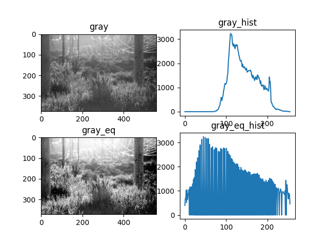
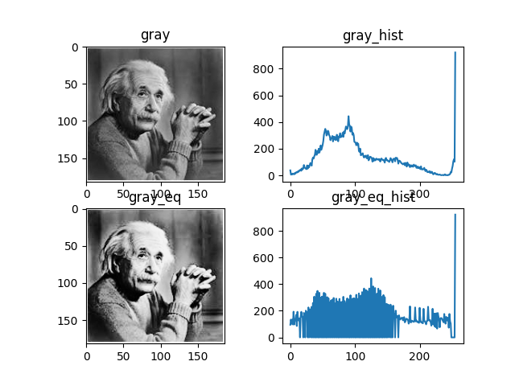

## Histogram Equalization

**Table of Contents**:

- [Histogram Equalization](#histogram-equalization)
  - [Introduction](#introduction)
  - [Opencv Builtin `cv2.equalizeHist()`](#opencv-builtin-cv2equalizehist)
  - [cv2.equalizeHist()](#cv2equalizehist)
  - [Output](#output)
  - [Discussion](#discussion)

### Introduction

Histogram equalization is a method in image processing of `contrast adjustment` using the image’s histogram.

This method usually increases the global contrast of many images, especially when the usable data of the image is represented by close contrast values. Through this adjustment, the intensities can be better distributed on the histogram. This allows for areas of lower local contrast to gain a higher contrast. Histogram equalization accomplishes this by effectively spreading out the most `frequent intensity` values. The method is useful in images with backgrounds and foregrounds that are both `bright` or both `dark`.

### Opencv Builtin `cv2.equalizeHist()`

OpenCV has a function to do this, `cv2.equalizeHist()`. Its input is just `grayscale` image and output is our histogram equalized image.


### cv2.equalizeHist() 

```py
gray_eq = cv2.equalizeHist(gray)
gray_eq_hist = cv2.calcHist([gray_eq], [0], None, [256], [0, 256])
```

### Output

- **Helps to enhanced the contrast**:



- **Bad Case - Histogram Equalization**



### Discussion

Histogram equalization is used to enhance contrast. It is not necessary that contrast will always be increase in this. There may be some cases were histogram equalization can be worse.
