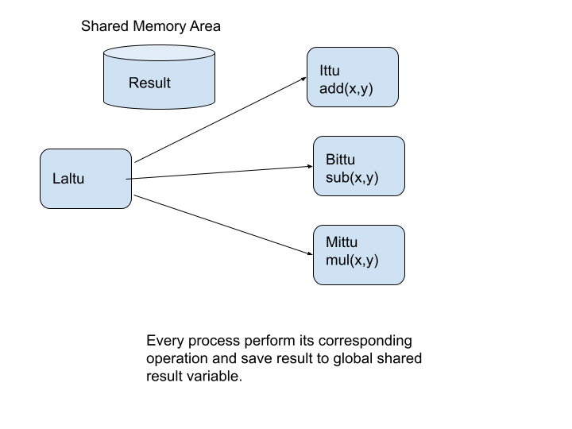

### Lab Experiment - 4

```
- Create a process, named Laltu, having three processes, named Ittu, Bittu, and Mittu .

- Laltu reads two variables 'a' and 'b' which all its child process know somehow.

- Ittu, Bittu, and Mittu  perform addition, subtraction and multiplication of
two variables read by Laltu and keep the output in a variable, 'Result'.

- Result will be seen and accessed by all processes. That means all processes will see the updated value of 'Result.

- All processes print their process ID, CPU Info, and values of 'a' and 'b' before performing their 
corresponding operation using separate printf instruction. Then they perform their operations 
which they are supposed to be done. Then each process will print 'Result'.

- Laltu will waits until Ittu, Bittu and Mittu finish their tasks.

- Take necessary steps to avoid inconsistency in 'Result'.
```




This two function `void write_to_shm(int x)` and `int read_from_shm(void)` are need to implement every program file. 
That's why I create a separate header file and include it every program to make code small and concise.

Both `write_to_shm()` and `read_from_shm()` are both implemented pretty state forward.

1. generate Key
1. using shmget() create block of shared memory
1. using shmat() attach shared memory to process
1. read/write to shared memory
1. using shmdt() detach shared memory from process


```c
/* take result variable as input */
void write_to_shm(int x) {
    key_t key = 1234;

    /* using key, create a block of shared memory */
    int sid = shmget(key, 1024, 0666 | IPC_CREAT);

    /* attach shared memory to a pointer */
    char *shm = shmat(sid, NULL, 0);

    /* write to shared memory */
    sprintf(shm, "%d", x);   /* x is the result variable */

    /* detach shared memory */
    shmdt(shm);
}
```

```c
int read_from_shm(void) {
    key_t key = 1234;

    /* using key, create a block of shared memory */
    int sid = shmget(key, 1024, 0666 | IPC_CREAT);

    /* attach shared memory to a pointer */
    char *shm = shmat(sid, NULL, 0);

    /* read from shared memory */
    int x = atoi(shm);

    /* detach shared memory */
    shmdt(shm);

    return x;
}
```

Now in `Laltu.c`, 

1. We read two integer number. Then using `write_to_shm()` we write the value of global result variable value.
2. Using `sem_open()` create semaphore.
3. Using for loop create three child under `Laltu`. They are `Ittu`, `Bittu`, and `Mittu`.
4. Ittu, Bittu and Mittu are execute from **Laltu** using `execlp()` method with `arg1`, and `arg2` that contains the value of `x` and `y` that we read in the very first of the program.

And in all three `Ittu.c`, `Bittu.c` and `Mittu.c` program.


**Example Program**:

```c
    sem_t *sem;

    /* convert string to number */
    int a = atoi(argv[0]);
    int b = atoi(argv[1]);

    sem = sem_open("/sem", O_CREAT, 0666, 1);

    sem_wait(sem);

    int x = read_from_shm();

    printf("[Bittu] - Before Subtraction [RESULT]: %d in child: %u and [CPU]: %d\n", x, getpid(), sched_getcpu());
    printf("a = %d, b = %d\n", a, b);

    int temp = a - b;
    write_to_shm(x + temp);

    int y = read_from_shm();
    printf("[Bittu] - After Subtraction [RESULT]: %d in child: %u and [CPU]: %d\n", y, getpid(), sched_getcpu());

    sem_post(sem);
```

1. Using `atoi()` convert string to integer that we pass as command line from `Laltu.c` - `execlp()` method.
2. Using `sem_open()` create semaphore.
3. `sem_wait(sem)`
4. Using `read_from_shm()` read global integer variable value in variable x. `Result is shared memory variable`
5. Perform operation.
6. Write using `write_to_shm(int x)` method.
7. `sem_post(sem)`
