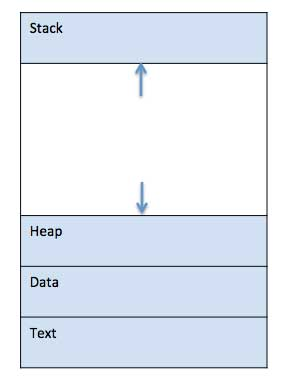
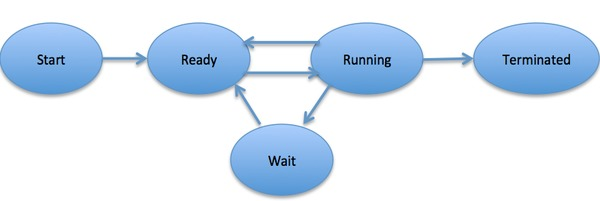

# Viva Question and Solutions

## Process

**What is a process**:

```text
* A process is basically a program in execution.
```

**How process stored in RAM/Memory**:



**Process Life Cycle**:

- Start
- Ready
- Running
- Waiting
- Terminate



**Process Control Block (PCB)**:

A Process Control Block is a data structure maintained by the Operating System for every process. The **PCB is identified by an integer process ID (PID)**. A PCB keeps all the information needed to keep track of a process

## Signal in OS

What is a signal?

- A signal is a message that is sent to a process to tell it to perform a specific task. Such as to terminate a process, to suspend a process, to resume a process, etc. The signal is sent to the process by the Operating System.

-  The kernel may pass an interrupt as a signal to the process that caused it (typical examples are SIGSEGV, SIGBUS, SIGILL and SIGFPE).

- An process can send signal itself vai kill().


## Deadlock

What is a deadlock? A

- Deadlock is a situation where two or more processes are waiting for each other to complete a task.
- To avoid a deadlock we use bankers algorithm.


## Threading

**What is a threading?**: A thread is a separate execution context in a process. A process can have multiple threads. A thread can be a process that is executing a single function. 


## IPC

## Process Synchronization
