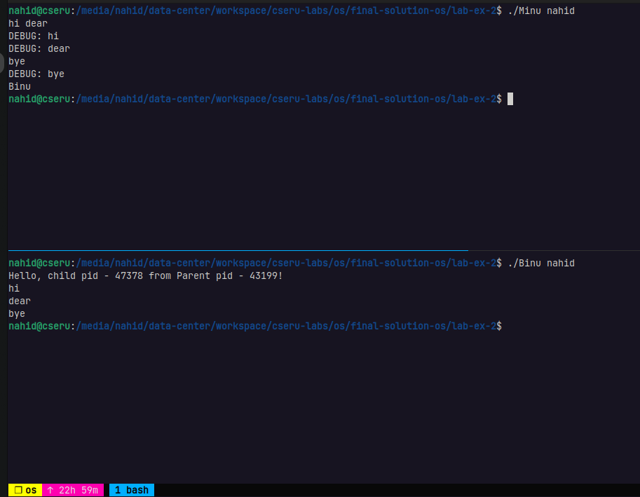

### Experiment - 2

```
1. Create a process, named PipeCreator, which can take 'n' number of name from the terminals and create 'n' named pipes.

2. Create two process named 'Minu' and 'Binu' which communicates via a named pipe created by PipeCreator.
Both process takes pipe name via terminals.

2.1) At first Minu will send its PID, its Parent's PID, and a Hello message to Binu via the common named pipe.
     Binu will display all messages received from Minu via the common named pipe in its shell.

2.2) After introductory message Minu will send message which user will type in the terminal.
     Binu will send message to Minu only once and that will be 'Bye'.
     Both Minu and Binu will terminate when they will receive 'Bye' message from the other side.

     For Minu, the user will type 'Bye' message.
     Binu will send static 'Bye' message to 'Minu' after getting 'Bye'  message from Minu.
```


- `./PipeCreator.c`
- `./Minu.c` & 
- `./Binu.c`

**Note**: Every time when open pipe it is very very important to notice that `the pipe is open is for reading or writing purpose.` Every time when you `open pipe`, after works done `pipe must be closed`. 

