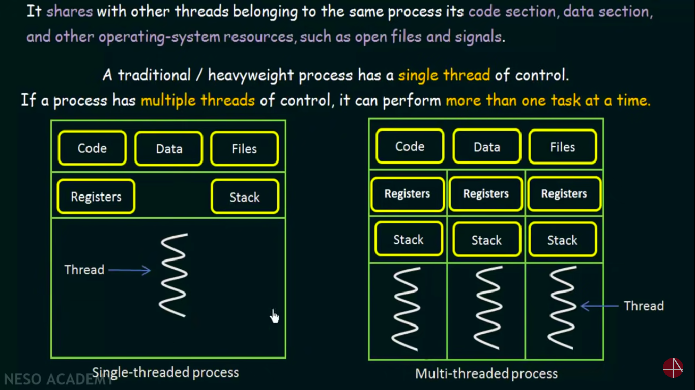
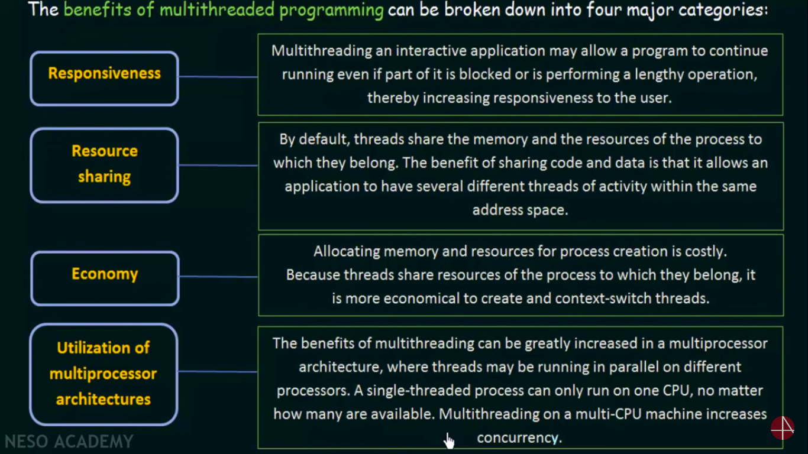
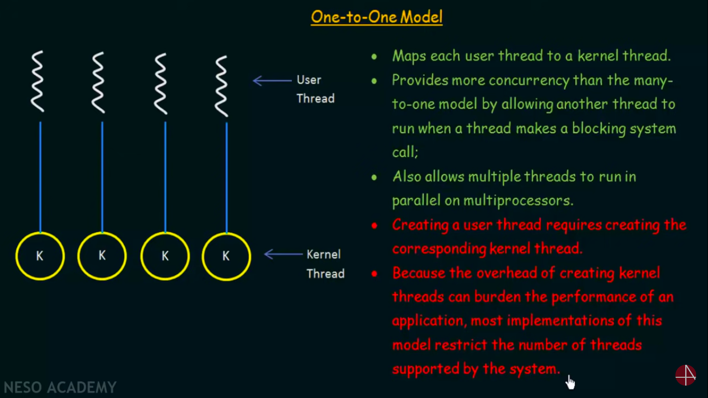

# Introduction to Operating System

- [Introduction to Operating System](#introduction-to-operating-system)
  - [Initial Resources](#initial-resources)
  - [Lecture#1](#lecture1)
  - [Lecture#2](#lecture2)
  - [Lecture#3](#lecture3)
  - [Lecture#4](#lecture4)
  - [Lecture on namedPipe](#lecture-on-namedpipe)
    - [Thread](#thread)

## Initial Resources

1. Start reading the following book: `Operating System Concepts by Abraham Silberschatz`
2. Install Ubuntu 18.04 OS. It is a free OS: `https://releases.ubuntu.com/18.04/`
3. Be  familiar with CLI (Command Line Interface) of Ubuntu. Some basic commands are attached.
4. Brush up your C programming skill.


**Slides Link**: <https://www.os-book.com/OS10/slide-dir/index.html>

## Lecture#1

```bash
$ top # top - Display Linux Processes

# command -option(short form) --option(full-form)
$ ps -aux # ps - report a snapshot of the current processes.

$ man ps # man - an interface to the system reference manuals.
```

**What an operating system do?**

The operating system (OS) manages all of the software and hardware on the computer. It performs basic tasks such as **file**, **memory** and **process management**, handling `input and output`, and `controlling peripheral devices` such as `disk drives` and `printers`.

অপারেটিং সিস্টেম মূলত **প্রোগ্রাম/ইন্সট্রাকশন/ইন্সট্রাকশন-সেট** রান করানো জন্য এই ইন্সট্রাকশন-সেট গুলো কিভাবে **রান** করানো হবে? **মেমোরিতে** কিভাবে রাখা হবে? কিভাবে **এক্সিকিউট** হবে সেইগুলা হ্যান্ডেল করে।

এখন ব্যবহারকারী এবং প্রোগ্রাম যদি একটি হত তাহলে কিন্তু আমাদের অপেরাটিং সিস্টেম এর দরকার হতো না। অপারেটিং সিস্টেম মূলত **মাল্টিটাস্ক/প্রসেস** হ্যান্ডেল করার জন্য প্রয়োজন।


```bash
$ pstree # pstree - display a tree of processes

$ pstree -p # show process tree with pid, root process name is systemd and pid is 0
# pstree -p option also shows the thread.
```

অপারেটিং সিস্টেম প্রসেস গুলো Parent-Child Relationship হিসেবে থাকে।

**Very basic example for feel for process**:

```bash
$ mkdir class-code && cd class-code/
$ vim infinity-loop-process-basics.c

int main() {
	while(1)
        ;
}

$ gcc infinity-loop-process-basics.c
$ ls
a.out infinity-loop-process-basics.c
$ ./a.out

# --- running the program ---

# see the process
$ pstree -p | grep a.out
$ ps -aux | grep a.out
$ top
```

> The `pid_t` data type is a `signed integer type` which is capable of representing a process ID. In the `GNU library`, this is an `int` . The **getpid()** function returns the process ID of the `current process`. The **getppid()** function returns the `process ID of the parent of the current process`.

```bash
$ vim process-id.c
```

```c
#include <stdio.h>
#include <unistd.h> /* getpid, pid_t, getppid */

int main() {
    // __pid_t pid;    /* __pid_t only used in debian based Operating System */

    /* pid_t is actually is the typedef of the __pid_t */
    /* #typedef __pid_t pid_t */

    pid_t pid; /* to store current process process id */
    pid_t ppid; /* to store current process parent process id */


    /* signature: pid_t getpid(void) and pid_t getppid(void) */
    pid = getpid(); /* return current process process id */
    ppid = getppid(); /* return current process parent process id */

    printf("Current process pid: %d\n", pid);
    printf("Current process parent's pid: %d\n", ppid);
}
```

**See process id and process tree**:

```bash
$ gcc process-id.c
$ ./a.out
Current process pid: 137133
Current process parents pid: 68891

$ pstree -ps 137602           # run from vscode bash terminal
systemd(1)───systemd(67008)───gnome-shell(67259)───code(68303)───code(68671)───code(68844)───bash(68891)───a.out(137602)

$ pstree -ps 138094           # run from gnome bash terminal
systemd(1)───systemd(67008)───gnome-terminal-(76293)───bash(76304)───a.out(138094)

$ pstree -pas 138094
systemd,1 splash
  └─systemd,67008 --user
      └─gnome-terminal-,76293
          └─bash,76304
              └─a.out,138094
$
```

- systemd(1) : system process
- systemd(67008): user accessible process.

**Kill a particular process**:

```bash
$ kill -9 <pid>
```

**Create Process or forking**:

**Process**: In the Operating System, a Process is something that is currently under execution.

|         n => 1 & 2         |            n = 3             |
| :------------------------: | :--------------------------: |
|  |  |

- Total child child number => 2^n - 1
- Parent only one.
- Total process number = 2^n.

> **fork()**: return **-1** (if child process creation is failed),**0** (child process), **+ve** (parent process)

**Fork Output**:

```c
#include <stdio.h>
#include <unistd.h>

int count = 0;

int main()
{
    fork();
    fork();
    fork();

    ++count;
    printf("Hello Forking() -  %d\n", count); /* ???what is the output ??? */
}

/**
 * @brief fork()
 *
 * Hello Forking() -  1
 * Hello Forking() -  1
 * Hello Forking() -  1
 * Hello Forking() -  1
 * Hello Forking() -  1
 * Hello Forking() -  1
 * Hello Forking() -  1
 * Hello Forking() -  1
 *
 */
```

**Forking Continue**:


> ***Upon successful completion, fork() returns 0 to the child process and returns the process ID of the child process to the parent process. Otherwise, -1 is returned to the parent process, no child process is created, and errno is set to indicate the error.***

```c
#include <stdio.h> /* printf() */
#include <unistd.h> /* getpid(void), pid_t, fork(void) */
#include <stdlib.h> /* exit(int) */

int main() {
    pid_t pid, cpid, cpid1; /* autoclass storage variable initially take grabage */

    // printf("%d %d %d\n", pid, cpid, cpid1);

    cpid = fork(); /* return 0(success) or -1/-ve(fail) or +ve(child pid pass to parent) */

    if (cpid < 0) {    /* process cannot be negative */
        printf("Unsuccessful\n");
        exit(-1);
    } else if (cpid == 0) {   /* child process */
        cpid1 = getpid();  /* child pid */
        printf("\nI am the child process and my pid = %d\n", cpid1);
    } else if (cpid > 0) {    /* parent process */
        pid = getpid();
        printf("\nI am the parent process and my pid = %d and my child process pid = %d\n", pid, cpid);
    }
}
```

```c
/**
 * @brief fork()
 *
 * fork() return -1 if it failed to create child process.
 * fork() return 0(to identify child process itself) and it pass to child process.
 * fork() return +ve(child process pid) and it pass to parent process.
 */
```

**Spooling**: Spooling is a process in which data is temporarily held to be used and executed by a device, program or the system. Data is sent to and stored in memory or other volatile storage until the program or computer requests it for execution. "Spool" is technically an acronym for simultaneous peripheral operations online.

## Lecture#2

**What is a zombie process???**:

On Unix and Unix-like computer operating systems, a zombie process or defunct process is a process that has completed execution (via the exit system call) but still has an entry in the process table: it is a process in the "Terminated state". This occurs for the child processes, where the entry is still needed to allow the parent process to read its child's exit status: once the exit status is read via the wait system call, the zombie's entry is removed from the process table and it is said to be "reaped". A child process always first becomes a zombie before being removed from the resource table. In most cases, under normal system operation zombies are immediately waited on by their parent and then reaped by the system – processes that stay zombies for a long time are generally an error and cause a resource leak, but the only resource they occupy is the process table entry – process ID.

The term zombie process derives from the common definition of zombie — an undead person. In the term's metaphor, the child process has "died" but has not yet been "reaped". Also, unlike normal processes, the kill command has no effect on a zombie process.

```c
/**
 * @file zombie.c
 * @author your name (Md. Nahid Hassan)
 * @brief A zombie process is a process that has terminated but is still in the process table.
 * @version 0.1
 * @date 2022-01-08
 *
 * @copyright Copyright (c) 2022
 *
 */
#include <stdio.h>
#include <stdlib.h>
#include <unistd.h>
#include <sys/wait.h>
#include <time.h>

int main(int argc, char *argv[]) {
    int pid;
    pid = fork();

    if (pid < 0) {
        perror("fork error\n");
        exit(0);
    } else if (pid == 0) {
        printf("I am the child process and my pid is = %d and my parent pid is = %d\n", getpid(), getppid());
    } else if (pid > 0) {
        /**
         * @brief how zombie process create here?
         * 1. parent process create child process.
         * 2. child process terminate and parent is sleeping.
         * 3. now parent process is waiting for child but child is
         *    already terminate so now child process is zombie process.
         * 4. parent process terminate.
         */
        sleep(10);
        printf("I am the parent process and my pid is = %d and my parent pid is = %d\n", getpid(), getppid());
    }
}
```

**Orphan Process**:
Zombie processes should not be confused with orphan processes: an orphan process is a process that is still executing, but whose parent has died. When the parent dies, the orphaned child process is adopted by init (process ID 1). When orphan processes die, they do not remain as zombie processes; instead, they are waited on by init. The result is that a process that is both a zombie and an orphan will be reaped automatically.

**execlp()**:

```c
#include <stdio.h>
#include <unistd.h>
#include <sys/wait.h>

int main() {
    char *argv[] = {"ls", "-l", NULL};
    /**
     * @brief execlp() is similar to execl(), but it searches for the command in the PATH environment variable.
     * execlp() is a wrapper function for the execvp() function.
     * @param pathname The name of the file to execute.
     * @param argv A pointer to an array of pointers to strings, each of which is an argument to the new program.
     * @return If the function succeeds, it returns a non-negative value.
     * If the function fails, it returns -1.
     * @remark The execvp() function is a wrapper function for the execv() function.
     * The execvp() function is used to execute a program.
     */

    // execvp("ls", argv);
    // we have another source hi.c file, so we can use execlp() to execute it.
    // first we need to compile it.
    // $ gcc -o hi hi.c
    // then we can use execlp() to execute it.

    int pid = fork();

    if (pid < 0) {
        perror("fork error\n");
    } else if (pid == 0) {
        /**
         * @brief execlp(path, arg1, arg2, ....., argN, NULL);
         * path: the name of the file to execute. object file.
         * arg1, arg2, ..., argN: the arguments to the new program.
         * NULL: the end of the argument list.
         */

        execlp("./hi","hi", NULL);
    } else {
        printf("I am the parent process.\n");
        /**
         * @brief wait() is used to wait for a child process to terminate.
         */
        wait(NULL);
    }


    return 0;
}
```

## Lecture#3

**Pipe**:

In computer programming, especially in UNIX operating systems, a **pipe** is a technique for `passing information from one program process to another`. Unlike other forms of inter-process communication (IPC), a pipe is one-way communication only. A pipe is `fixed in size` and is usually at least **4,096** bytes.

**Two way pipes**:


**Unnamed Pipe**:

```c
/**
 * @file unnamed-pipe2.c
 * @author SB Mam
 * @brief
 * @version 0.1
 * @date 2021-08-10(YY//MM//DD)
 *
 * @copyright Copyright (c) 2021
 *
 */

#include<unistd.h>
#include<stdio.h>
#include<stdlib.h>
#include<string.h>
#include<sys/wait.h>


int main(){
	int pipeFD[2], status;
	pid_t childPID;

	// Create a pipe. pipeFD[0]: Read purpose & pipeFD[1]: Write purpose
	status = pipe(pipeFD);
	if (status == -1){// Failure case.
		printf("Error!!!");
		exit(-1);
	}
	printf("Pipe descriptors: %d, %d\n", pipeFD[0], pipeFD[1]); // 3(read), 4(write)

	// Create a child
	childPID = fork();

	if (childPID == -1){ // Failure case.
		printf("Error!!!");
		exit(-1);
	}
	else if (childPID == 0){ // Child will execute this part.
		printf("Child Process is writing to the pipe.\n");
		close(pipeFD[0]);
		char *msg = "Hello\n";
		write(pipeFD[1], msg, strlen(msg) + 1);
	}
	else if (childPID > 0){// Parent will execute this part.
		wait(NULL);

		printf("Parent Process is reading from the pipe.\n");
		close(pipeFD[1]);

		char buffer[200];
		read(pipeFD[0], buffer, sizeof(buffer));
		printf("%s\n", buffer);
	}

	return 0;

}
```

In **Unix/Linux** based system **pipe** is in generally use in command line.

```bash
# count the number of lines of a text document.
$ cat documents.txt | wc -l      # `|` is the pipe sign
```

## Lecture#4

**CPU Scheduling Algorithm**:


**CPU Scheduling Criteria**:


> **Note** Learn to calculate all of this criteria.

**Burst Time(BT)**: `Burst Time refers to the time required in milliseconds by a process for its execution.` The Burst Time takes into consideration the CPU time of a process. The I/O time is not taken into consideration. It is called as the execution time or running time of the process.

C main() arguments:

**argcv.c**:

```c
#include <stdio.h>

int main(int argc, char const *argv[]) {
    int i;

    for (i = 0; i < argc; i++) {
        printf("argv[%d] = %s\n", i, argv[i]);
    }

    return 0;
}
```

```bash
# compile...
$ gcc argcv.c

# run with command line arguments...
$ ./a.out 10 20 age 30
argv[0] = ./a.out
argv[1] = 10
argv[2] = 20
argv[3] = age
argv[4] = 30
```

**User Mode and Kernel Mode**: The User mode is normal mode where the process has limited access. While the Kernel mode is the privileged mode where the process has unrestricted access to system resources like hardware, memory, etc.


> **Note**: To switch from user mode to kernel mode you need to perform a system call.


**Assignment#1**:

Write a program so that there will be **five processes**: `one parent process` and `four child processes`.

1. Parent process who will
    - create four child processes
    - read two numbers from the keyboard
    - send numbers to its four child processes

2. Child processes will have name Addition, Subtraction, Multiplication and Division.
    - Child processes will get two numbers from the parent process and perform operations  to justify their name Display output to the monitor
3. All processes will be in infinite loop so that you can see all processes in the process tree by **pstree** command.

> Solution Added Soon!!

## Lecture on namedPipe

- First Create a namedPipe using `mkfifo` command.
- Then write something on this pipe.

```bash
# create pipe
$ mkfifo 1stPipe

$ echo 'Hi, Dear' > 1stPipe
.. executing but block..
```

- Secondly Create another bash/shell session...
- Now read from this pipe.

```bash
# read first pipe...
$ cat 1stPipe           # now echo 'Hi, Dear' is closed
Hi, Dear
```

After that...


```bash
$ echo 'Hi, Dear' > 1stPipe # closed.
$                           # back to prompt
```

**User-Group-Other** permissions on Linux:

| permission | Value  | User  | Group | Others |
| :--------- | :----: | :---: | :---: | :----: |
| read       | 100(4) |   4   |   4   |   4    |
| write      | 010(2) |   2   |   2   |   2    |
| execute    | 001(1) |   1   |   1   |   1    |
| SUM        |        |   7   |   7   |   7    |

```bash
$ chmod 777 file.txt # set all the permission for all level of user
```

**named-pipe-write.c**:

```c
#include <stdio.h>
#include <sys/types.h>
#include <sys/stat.h>
#include <stdlib.h>
#include <fcntl.h>
#include <unistd.h>
#include <string.h>

int main()
{
    // int status;

    // for create pipe, if pipe already exist then it will return -1
    // mkfifo(path, permissions);
    // status = mkfifo("./fifoPipe", 0666);
    // if (status == -1) {
    //     perror("mkfifo"); // mkfifo: File exists
    //     exit(-1);
    // }

    int fd;
    char *pipePath = "./fifoPipe";
    char *msg = "Hello World\n\0";

    fd = open(pipePath, O_WRONLY);
    write(fd, msg, strlen(msg));
    close(fd);
}
```

Next,

```bash
$ gcc named-pipe-write.c -o named-pipe-write
$ ./named-pipe-write
....... blocked ...........
```

**named-pipe-read.c**:

```c
#include <stdio.h>
#include <sys/types.h>
#include <sys/stat.h>
#include <stdlib.h>
#include <fcntl.h>
#include <unistd.h>
#include <string.h>

int main() {
    char buffer[50];

    char *pipePath = "./fifoPipe";
    int fd = open(pipePath, O_RDONLY); // read only

    read(fd, buffer, sizeof(buffer));  // read from pipe
    printf("%s\n", buffer);
}
```

Next,

```bash
$ gcc named-pipe-read.c -o named-pipe-read
$ ./named-pipe-read
Hello World
```

And finally `./named-pipe-write` is released.

### Thread









```c

#include <stdio.h>
#include <pthread.h>

void sub_thread1(){
	int i;

	for (i = 1; i < 1000000; i++)
		printf("%d. Sub Thread1\n", i);	
}

void sub_thread2(){
	int i;

	for (i = 1; i < 1000000; i++)
		printf("%d. Sub Thread2\n", i);	
}

int main(){
	int i;
	pthread_t threadID1, threadID2;

	pthread_create(&threadID1, NULL, (void *) sub_thread1, NULL);
	pthread_create(&threadID2, NULL, (void *) sub_thread2, NULL);

	for (i = 1; i < 1000000; i++)
		printf("%d. Main Thread\n", i);

	return 0;
}
```