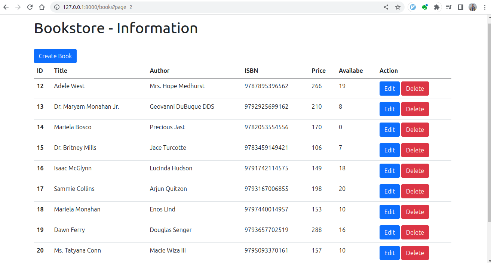

# Step by step create curd project in laravel 

- [Step by step create curd project in laravel](#step-by-step-create-curd-project-in-laravel)
    - [01 - Setup](#01---setup)
    - [02 - Create migration and then migrate](#02---create-migration-and-then-migrate)
    - [03 - Database Seeding - (Model, Factory, Seeder)](#03---database-seeding---model-factory-seeder)
    - [04 - Create CRUD Application](#04---create-crud-application)


### 01 - Setup

1. Create or clone project.

```bash
# --------------- create fresh project ----------------
$ composer create-project laravel/laravel project_name
$ cd project_name

# ------------ clone project --------------------------
$ git clone https://github.com/Nahid-Hassan/job-prep.git 
$ ls
job-prep # project 
$ cd job-prep
$ ls

nahid@cseru:~/Desktop/blog$ ls
app      bootstrap      composer.lock  database      phpunit.xml  README.md  routes   tests   vite.config.js
artisan  composer.json  config         package.json  public       resources  storage  vendor  

$ composer update
```

2. Work with `.env` file.

```bash
$ mv .env.example .env
```

3. Goto `.env` file and change the database name.

```text
DB_CONNECTION=mysql
DB_HOST=127.0.0.1
DB_PORT=3306
DB_DATABASE=test
DB_USERNAME=root
DB_PASSWORD=password
```

Then create database inside your `laragon.heidisql -> larvel.mysql` 

4. If key is not generate yet...

```bash
$ php artisan key:generate
```

5. Run your project

```bash
$ php artisan serve 
```

### 02 - Create migration and then migrate

1. Create migration

```bash
$ php artisan make:migration create_books_table
```

This command create a migration file named `create_books_table.php` inside `database/migrations/...create_books_table.php`.

Now inside `...create_books_table.php` file,

```php
return new class extends Migration
{
    /**
     * Run the migrations.
     */
    public function up(): void
    {
        Schema::create('books', function (Blueprint $table) {
            $table->id();
            $table->string("title");
            $table->string("author");
            $table->string("isbn");
            $table->integer("price");
            $table->integer("available");
            $table->timestamps();
        });
    }

    /**
     * Reverse the migrations.
     */
    public function down(): void
    {
        Schema::dropIfExists('books');
    }
};
```

2. Make migrate: create database table inside your database.

```bash
$ php artisan migrate
```

### 03 - Database Seeding - (Model, Factory, Seeder) 

1. Create Model,

```bash
$ php artisan make:model Book # Book is the model name
```

This command create a `[app/Models/Book.php]` file. Now edit `Book.php` file,

```php
class Book extends Model
{
    use HasFactory;
    protected $fillable = ['title','author','isbn','price','available'];

}
```

2. Create factory,

```bash
$ php artisan make:factory BookFactory --model=Book
```

Now this command create a `database/factories/BookFactory.php]` file. Now edit `BookFactory.php` file.

```php
class BookFactory extends Factory
{
    /**
     * Define the model's default state.
     *
     * @return array<string, mixed>
     */
    public function definition(): array
    {
        return [
            'title' => fake()->name(),
            'author' => fake()->name(),
            'isbn' => fake()->unique()->isbn13(),
            'price' =>fake()->numberBetween(100,300),
            'available' =>fake()->numberBetween(0,20)
        ];
    }
}
```

3. Create database seeder,

```bash
$ php artisan make:seeder BookSeeder
```

This command create a `[database/seeders/BookSeeder.php]` file. Now edit this `BookSeeder.php` file.

```php
class BookSeeder extends Seeder
{
    /**
     * Run the database seeds.
     */
    public function run(): void
    {
        \App\Models\Book::factory(50)->create();
    }
}
```

and make a changed in `database/seeders/DatabaseSeeder.php` file.

```php
class DatabaseSeeder extends Seeder
{
    /**
     * Seed the application's database.
     */
    public function run(): void
    {
        // \App\Models\User::factory(10)->create();

        // \App\Models\User::factory()->create([
        //     'name' => 'Test User',
        //     'email' => 'test@example.com',
        // ]);
        $this->call(BookSeeder::class);
    }
}
```

Now run,

```bash
$ php artisan db:seed 
```

Hope successfully seeded data into your database table. **Hurrah...**

### 04 - Create CRUD Application 


1. Create Controller,

```bash
$ php artisan make:controller BookController --model=Book
```

This command create a `/app/Http/Controllers/BookController.php` file. Now open this file.

```php
<?php

namespace App\Http\Controllers;

use App\Models\Book;
use Illuminate\Http\Request;

class BookController extends Controller
{
    /**
     * Display a listing of the resource.
     */
    public function index()
    {
        //
    }

    /**
     * Show the form for creating a new resource.
     */
    public function create()
    {
        //
    }

    // ...........
    // ...........
    // ...........
    // ...........
}
```

Now we are step by step to create **route**, implement BookController `method` and corresponding **views**.

`/routes/web.php`,

```php
// ---------------- Initial code --------------------
<?php

use Illuminate\Support\Facades\Route;

// comment out the older default route

// Route::get('/', function () {
//     return view('welcome');
// });

// ------------- create our route ----------------
Route::get("/books", [BookController::class, "index"])->name("books.index");
```

`/app/Http/Controllers/BookController.php`,

```php
    // ..................
    public function index()
    {
        // $books = Book::all();
        $books = Book::paginate(10);

        return view("books.index", ["books"=> $books]);
    }
    // .................
```

Now create a folder inside `/resources/views/` name `books` and inside `books` folder create a file name,
`index.blade.php`.

```bash
$ cd resources/views/
$ mkdir books                     # do all things in your editor don't need to use command line.
$ cd books                        # but if you are familiar with command line, you can do this.    
$ touch index.blade.php
```

Now open `index.blade.php`,

Add `Bootstrap starter code` and a Bootstrap `table`.

```php
<!doctype html>
<html lang="en">

<head>
    <meta charset="utf-8">
    <meta name="viewport" content="width=device-width, initial-scale=1">
    <link href="https://cdn.jsdelivr.net/npm/bootstrap@5.0.2/dist/css/bootstrap.min.css" rel="stylesheet"
        integrity="sha384-EVSTQN3/azprG1Anm3QDgpJLIm9Nao0Yz1ztcQTwFspd3yD65VohhpuuCOmLASjC" crossorigin="anonymous">

    <title>Bookstore</title>
</head>

<body>
    <div class="container">
        <h1>Bookstore - Information</h1>

        <table class="table">
            <thead>
                <tr>
                    <th scope="col">ID</th>
                    <th scope="col">Title</th>
                    <th scope="col">Author</th>
                    <th scope="col">ISBN</th>
                    <th scope="col">Price</th>
                    <th scope="col">Availabe</th>
                </tr>
            </thead>
            <tbody>
                @foreach ($books as $book)
                <tr>
                    <th scope="row"> {{ $book->id }} </th>
                    <td> {{ $book->title  }} </td>
                    <td> {{ $book->author  }} </td>
                    <td> {{ $book->isbn  }} </td>
                    <td> {{ $book->price  }} </td>
                    <td> {{ $book->available  }} </td>
                </tr>
                @endforeach
            </tbody>
        </table>

    </div>

    <script src="https://cdn.jsdelivr.net/npm/bootstrap@5.0.2/dist/js/bootstrap.bundle.min.js"
        integrity="sha384-MrcW6ZMFYlzcLA8Nl+NtUVF0sA7MsXsP1UyJoMp4YLEuNSfAP+JcXn/tWtIaxVXM" crossorigin="anonymous">
    </script>
</body>

</html>
```


Now added pagination in view page, for that,

Little modify in `/resources/views/books/index.blade.php` file.... add little code below the `</table>` tag.

```php
        </tbody>
        </table>
        
        {{ $books->links() }}  # new line...
    
    </div>
```

And modify inside the `/app/Providers/AppServiceProvider.php` file.

```php
<?php

namespace App\Providers;

use Illuminate\Pagination\Paginator;                     # new line
use Illuminate\Support\ServiceProvider;

class AppServiceProvider extends ServiceProvider
{
    /**
     * Register any application services.
     */
    public function register(): void
    {
        //
    }

    /**
     * Bootstrap any application services.
     */
    public function boot(): void
    {
        Paginator::useBootstrap();                        # new line
    }
}
```


2. Now implement `create()` method in `BookController.php` file. 

Now at first create a `route` inside `/routes/web.php` file.

```php
// ............
Route::post("/books", [BookController::class, "store"])->name("books.store");     # form action route
Route::get("/books/create", [BookController::class, "create"])->name("books.create");
```

And then,

`/app/Http/Controllers/BookController.php`,

```php
    // ..............
    public function create()
    {
        return view("books.create");
    }
    // ..............
```

Now we need to create a file inside `/resources/views/books/` directory and file name should be, `create.blade.php`.

```
# inside /resources/views/books/ directory,
$ touch create.blade.php                      # you just create this file using gui. no need command line.
```


`index.blade.php` file, make a little modifications in the `/resources/views/books/index.blade.php` file, add an route to the `create.blade.php` page.

```php
// ................
        <h1>Bookstore - Information</h1>
        <a href="{{ route ("books.create")}}" class="btn btn-primary mt-4">Create Book</a>    # new line
        <table class="table">
// .................
```

Now edit `create.blade.php` file.

`create.blade.php` file,

```php
<!doctype html>
<html lang="en">

<head>
    <meta charset="utf-8">
    <meta name="viewport" content="width=device-width, initial-scale=1">
    <link href="https://cdn.jsdelivr.net/npm/bootstrap@5.0.2/dist/css/bootstrap.min.css" rel="stylesheet"
        integrity="sha384-EVSTQN3/azprG1Anm3QDgpJLIm9Nao0Yz1ztcQTwFspd3yD65VohhpuuCOmLASjC" crossorigin="anonymous">

    <title>Bookstore</title>
</head>

<body>
    <div class="m-4"></div>
    <div class="container">
        <h2 class="mt-4">Create Book</h2>

        <form action="{{ route('books.store') }}" method="POST" }}>
            @csrf
            <div class="mb-3">
                <label for="exampleInputEmail1" class="form-label">Title</label>
                <input type="text" name="title" value="{{ old('title') }}" class="form-control" aria-describedby="emailHelp">
                @error('title')
                    <small class="text-danger"> {{ $message }} </small>
                @enderror
            </div>

            <div class="mb-3">
                <label for="exampleInputEmail1" class="form-label">Author</label>
                <input type="text" name="author" value="{{ old('author') }}" class="form-control" aria-describedby="emailHelp">
                @error('author')
                    <small class="text-danger"> {{ $message }} </small>
                @enderror
            </div>

            <div class="mb-3">
                <label for="exampleInputEmail1" class="form-label">ISBN</label>
                <input type="text" name="isbn" value="{{ old('isbn') }}" class="form-control" aria-describedby="emailHelp">
                @error('isbn')    
                    <small class="text-danger"> {{ $message }} </small>
                @enderror
            </div>
            <div class="mb-3">
                <label for="exampleInputEmail1" class="form-label">Price</label>
                <input type="number" name="price" value="{{ old('price') }}" class="form-control" aria-describedby="emailHelp">
                @error('price')    
                    <small class="text-danger"> {{ $message }} </small>
                @enderror
            </div>
            <div class="mb-3">
                <label for="exampleInputEmail1" class="form-label">Available</label>
                <input type="number" name="available" value="{{ old('available') }}" class="form-control" aria-describedby="emailHelp">
                @error('available')     
                    <small class="text-danger"> {{ $message }} </small>
                @enderror
            </div>

            <button type="submit" class="btn btn-primary">Submit</button>
        </form>

    </div>
    <script src="https://cdn.jsdelivr.net/npm/bootstrap@5.0.2/dist/js/bootstrap.bundle.min.js"
        integrity="sha384-MrcW6ZMFYlzcLA8Nl+NtUVF0sA7MsXsP1UyJoMp4YLEuNSfAP+JcXn/tWtIaxVXM" crossorigin="anonymous">
    </script>
</body>

</html>
```

and finally, `/app/Http/Controllers/BookstoreController.php` file,

```php
    /**
     * Show the form for creating a new resource.
     */
    public function create()
    {
        return view("books.create");
    }

    /**
     * Store a newly created resource in storage.
     */
    public function store(Request $request)
    {
        //
        // return $request->all();
        // dd($request->all()); 

        $request->validate(
            [
                "title" => "required|string",
                "author" => "required|string",
                "isbn" => "required",
                "price" => "required|numeric",
                "available" => "required|integer",
            ]
        );

        // dd($request->all());

        Book::create([
            'title'=>$request->title,
            'author'=>$request->author,
            'isbn'=>$request->isbn,
            'price'=>$request->price,
            'available'=>$request->available
        ]);

        return redirect()->route("books.index");
    }
```


2. Edit the book,

At first edit `/resources/views/books/index.blade.php`, file.

- Add a new column name `Action`.

```php
            <thead>
                <tr>
                    <th scope="col">ID</th>
                    <th scope="col">Title</th>
                    <th scope="col">Author</th>
                    <th scope="col">ISBN</th>
                    <th scope="col">Price</th>
                    <th scope="col">Availabe</th>
                    <th scope="col">Action</th>           // new
                </tr>
            </thead>

// and....

                    <td>                                  // new
                        <a href="{{ route('books.edit', ['book'=>$book])}}" class="btn btn-primary">Edit</a>
                        <form action="" method="POST" class="d-inline">
                            @csrf
                            @method("DELETE")
                            <button type="submit" class="btn btn-danger">Delete</button>
                        </form>
                    </td>
```

Create route,

`/routes/web.php`,

```php
Route::get("/books/{book}/edit", [BookController::class, "edit"])->name("books.edit");
Route::patch("/books/{book}", [BookController::class, "update"])->name("books.update");
```

Create corresponding method for routes,

`/app/Http/Controllers/BookController.php`,

```php

  /**
     * Show the form for editing the specified resource.
     */
    public function edit(Book $book)
    {
        return view('books.edit', array('book' => $book));
    }

    /**
     * Update the specified resource in storage.
     */
    public function update(Request $request, Book $book)
    {
        $data = $request->validate(
            [
                "title" => "required|string",
                "author" => "required|string",
                "isbn" => "required",
                "price" => "required|numeric",
                "available" => "required|integer",
            ]
        );

        $book->update($data);

        return redirect()->route("books.index")->with('Success', 'Book updated successfully');
    }
```

Now create `edit.blade.php` file inside `/resources/views/books/` directory,  and `edit.blade.php` file.

```php
<!doctype html>
<html lang="en">

<head>
    <meta charset="utf-8">
    <meta name="viewport" content="width=device-width, initial-scale=1">
    <link href="https://cdn.jsdelivr.net/npm/bootstrap@5.0.2/dist/css/bootstrap.min.css" rel="stylesheet"
        integrity="sha384-EVSTQN3/azprG1Anm3QDgpJLIm9Nao0Yz1ztcQTwFspd3yD65VohhpuuCOmLASjC" crossorigin="anonymous">

    <title>Bookstore</title>
</head>

<body>
    <div class="m-4"></div>
    <div class="container">
        <h2 class="mt-4">Update Book</h2>

        <form action="{{ route ('books.update', ['book'=>$book]) }}" method="POST" }}>
            @csrf
            @method("PATCH")
            <div class="mb-3">
                <label for="exampleInputEmail1" class="form-label">Title</label>
                <input type="text" name="title" value="{{ $book->title }}" class="form-control" aria-describedby="emailHelp">
                @error('title')
                    <small class="text-danger"> {{ $message }} </small>
                @enderror
            </div>

            <div class="mb-3">
                <label for="exampleInputEmail1" class="form-label">Author</label>
                <input type="text" name="author" value="{{ $book->author }}" class="form-control" aria-describedby="emailHelp">
                @error('author')
                    <small class="text-danger"> {{ $message }} </small>
                @enderror
            </div>

            <div class="mb-3">
                <label for="exampleInputEmail1" class="form-label">ISBN</label>
                <input type="text" name="isbn" value="{{ $book->isbn }}" class="form-control" aria-describedby="emailHelp">
                @error('isbn')    
                    <small class="text-danger"> {{ $message }} </small>
                @enderror
            </div>
            <div class="mb-3">
                <label for="exampleInputEmail1" class="form-label">Price</label>
                <input type="number" name="price" value="{{ $book->price }}" class="form-control" aria-describedby="emailHelp">
                @error('price')    
                    <small class="text-danger"> {{ $message }} </small>
                @enderror
            </div>
            <div class="mb-3">
                <label for="exampleInputEmail1" class="form-label">Available</label>
                <input type="number" name="available" value="{{ $book->available }}" class="form-control" aria-describedby="emailHelp">
                @error('available')     
                    <small class="text-danger"> {{ $message }} </small>
                @enderror
            </div>

            <button type="submit" class="btn btn-primary">Update</button>
            <a href="{{ route("books.index") }}" class="btn btn-secondary">Cancel</a>
        </form>

    </div>
    <script src="https://cdn.jsdelivr.net/npm/bootstrap@5.0.2/dist/js/bootstrap.bundle.min.js"
        integrity="sha384-MrcW6ZMFYlzcLA8Nl+NtUVF0sA7MsXsP1UyJoMp4YLEuNSfAP+JcXn/tWtIaxVXM" crossorigin="anonymous">
    </script>
</body>

</html>
```

3. Delete the specified book from the database,

Create routes, `/routes/web.php`

```php
Route::delete("/books/{book}", [BookController::class, "destroy"])->name("books.destroy"); // new
```

open `/app/Http/Controllers/BookController.php`,

```php
   public function destroy(Book $book)
    {
        $book->delete();

        return redirect()->route("books.index")->with('Success', 'Book deleted successfully');
    }
```

Make little change in the `index.blade.php` template,

```php
                    <td>
                        <a href="{{ route('books.edit', ['book'=>$book])}}" class="btn btn-primary">Edit</a>
                        <form action="{{ route('books.destroy', ['book'=>$book]) }}" method="POST" class="d-inline">
                            @csrf
                            @method("DELETE")
                            <button type="submit" class="btn btn-danger">Delete</button>
                        </form>
                    </td>

                    //!!!!! {{ route('books.destroy', ['book'=>$book]) }} this as forms action.
```

